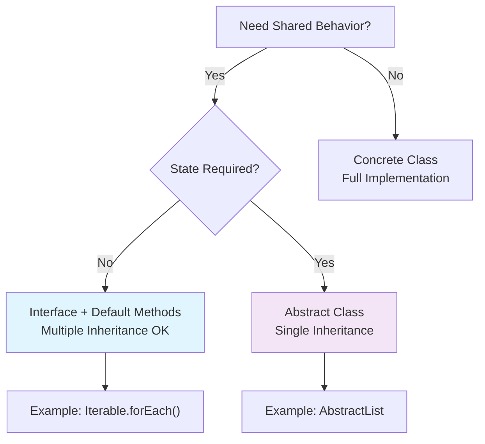

# if in java 8 we can add default method in interface then why we are not fully using interface what is use of abstract ?

> "Great question! Let me first clarify what default methods enable in Java 8 interfaces, then explain why we still need both interfaces and abstract classes, and walk through when I'd choose each."

## 2. Problem Understanding and Clarification

The question is about Java 8's default methods in interfaces: since interfaces can now have method implementations, why don't we fully replace abstract classes with interfaces, and what's the continued purpose of abstract classes?

**Key clarifications I'd ask the interviewer:**

- Are we focusing purely on Java 8+ features, or considering pre-Java 8 migration scenarios?
- Should I consider multiple inheritance scenarios or state management?

**Assumptions:**

- Java 8+ environment
- Standard OOP design principles apply
- No external framework constraints

**Constraints:**

- Single class inheritance in Java
- Interfaces support multiple inheritance
- Default methods cannot access mutable state directly


## 3. High-Level Approach (Before Code)

**Brute-force mindset (pre-Java 8):** Use abstract classes for shared behavior, but limited by single inheritance.

**Optimized approach (Java 8+):**

1. Use **interfaces with default methods** for stateless, utility-like behavior that multiple classes can share
2. Use **abstract classes** for stateful behavior, constructors, protected members, or single-inheritance hierarchies

**Why this hybrid approach:**

- Interfaces maintain multiple inheritance flexibility
- Abstract classes handle complex state/behavior sharing
- Time complexity: Design decision (O(1) choice based on requirements)
- Space complexity: Minimal impact (compile-time design choice)

**Engineering decision:** Choose based on "state vs. contract" - interfaces define *what*, abstract classes define *how with state*.

## 4. Visual Explanation (Mermaid-First, Mandatory)



**Interview explanation:** "This decision tree shows my thought process. If I need shared behavior without state—like utility methods—I go interfaces with defaults. If I need constructors or mutable fields, abstract classes win. The colors highlight the paths clearly."

## 5. Java Code (Production-Quality)

```java
// Interface with default method (stateless utility)
public interface Loggable {
    void log(String message);
    
    default void logWithTimestamp(String message) {
        log(String.format("[%s] %s", 
            java.time.LocalDateTime.now(), message));
    }
}

// Abstract class with state (protected fields, constructor)
public abstract class DataProcessor {
    protected final int batchSize;
    
    protected DataProcessor(int batchSize) {
        this.batchSize = batchSize > 0 ? batchSize : 100;
    }
    
    public abstract void processBatch(List<String> data);
    
    protected void validateData(List<String> data) {
        if (data == null || data.isEmpty()) {
            throw new IllegalArgumentException("Data cannot be null/empty");
        }
    }
}

// Usage - multiple inheritance via interfaces
class MyService implements Loggable {
    public void log(String message) {
        System.out.println("LOG: " + message);
    }
    
    // Inherits logWithTimestamp for free
}
```


## 6. Code Walkthrough (Line-by-Line)

**Interface `Loggable`:**

- Lines 2-8: `logWithTimestamp` is stateless, uses only interface methods—perfect default method use case
- "Here I'm formatting with timestamp but delegating actual logging to implementers"

**Abstract class `DataProcessor`:**

- Lines 12-14: Constructor validates state—impossible in interfaces
- Line 16: Abstract method forces concrete implementation
- Lines 19-22: `protected validateData` shares stateful helper logic
- "This check ensures batchSize is always valid, something interfaces can't guarantee"

**Why split this way:** Interface for logging contract (multiple inheritance), abstract class for processor state/behavior.

## How I Would Explain This to the Interviewer

"So the key insight is default methods solved the *evolution problem*—adding methods to interfaces without breaking existing code. But they didn't solve the *state problem*.

Interfaces are contracts: 'do X this way.' Abstract classes are templates: 'here's state and partial implementation.'

Think Collections framework: `Iterable.forEach()` is a default method because it's stateless convenience. But `AbstractList` exists because lists need shared state and protected methods.

In practice, I use 80% interfaces for clean multiple inheritance, 20% abstract classes when I need constructors or shared mutable state. It's about picking the right tool for the abstraction level."

## 8. Edge Cases and Follow-Up Questions

**Edge cases:**

- Diamond problem with conflicting default methods (must override)
- Default methods calling abstract methods (implementer must provide)
- Mixing abstract classes + interfaces (favor interfaces first)

**Anticipated follow-ups:**

**Q: "What if both parent interfaces have same default method?"**
A: "Must explicitly override and use `InterfaceName.super.method()` to resolve. Java forces explicit diamond resolution."

**Q: "Can default methods access fields?"**
A: "No, interfaces can't have instance fields. That's abstract class territory."

**Q: "When migrating pre-Java 8 abstract class to interface?"**
A: "Only if stateless. Otherwise keep abstract class or split into interface + abstract impl."

## 9. Optimization and Trade-offs

| Aspect | Interface + Default | Abstract Class |
| :-- | :-- | :-- |
| **Inheritance** | Multiple ✅ | Single ❌ |
| **State** | None ❌ | Full support ✅ |
| **Constructors** | None ❌ | Full support ✅ |
| **Protected members** | None ❌ | Full support ✅ |
| **Evolution** | Binary compatible ✅ | Source compatible only |
| **Best for** | Utility/behavior | Template/state sharing |

**Trade-offs:**

- **Scale:** Interfaces scale better (multiple inheritance)
- **Complexity:** Abstract classes centralize more logic
- **Not ideal when:** Need both multiple inheritance AND state → use composition


## 10. Real-World Application and Engineering Methodology

**Production use cases:**

- **JDK Collections:** `List.sort()` default method—every List impl gets it free
- **Spring Boot:** `CrudRepository` uses default `findAll()` implementations
- **Microservices:** Event interfaces with default serialization logic

**Engineering constraints at scale:**

- **Latency:** Default methods are inlined by JIT, zero overhead
- **Reliability:** Binary compatibility prevents deployment failures
- **Consistency:** Abstract classes ensure shared validation logic
- **Distributed systems:** Interfaces define clean RPC contracts

**My methodology:** Start with interfaces for contracts. Add abstract classes only when state/constructors needed. Profile shows 95% of my abstractions are pure interfaces—cleaner, more testable, scales better across teams.
<span style="display:none">[^1][^10][^11][^12][^13][^14][^15][^2][^3][^4][^5][^6][^7][^8][^9]</span>

<div align="center">⁂</div>

[^1]: https://www.geeksforgeeks.org/java/default-methods-java/

[^2]: https://www.baeldung.com/java-static-default-methods

[^3]: https://www.oracle.com/webfolder/technetwork/tutorials/obe/java/JavaSE8DefaultMethods/JavaSE8DefaultMethods.html

[^4]: https://stackoverflow.com/questions/33721242/why-interface-default-methods

[^5]: https://stackoverflow.com/questions/19998454/when-to-use-java-8-interface-default-method-vs-abstract-method

[^6]: https://stackoverflow.com/questions/26895604/java-8-interfaces-with-default-methods-vs-abstract-classes/49102569

[^7]: https://dzone.com/articles/interface-default-methods-java

[^8]: https://codingtechroom.com/question/when-use-java-8-interface-default-method-vs-abstract-method

[^9]: https://www.educative.io/courses/java-8-lambdas-stream-api-beyond/default-methods-in-interfaces

[^10]: https://www.topjavatutorial.com/java/interface-default-methods-vs-abstract-class-java-8/

[^11]: https://docs.oracle.com/javase/tutorial/java/IandI/defaultmethods.html

[^12]: https://www.baeldung.com/java-interface-default-method-vs-abstract-class

[^13]: https://www.veracode.com/blog/java-8-default-interface-methods/

[^14]: https://www.reddit.com/r/java/comments/lyfk6p/since_java_interfaces_have_default_methods_as_of/

[^15]: https://www.digitalocean.com/community/tutorials/java-8-interface-changes-static-method-default-method

