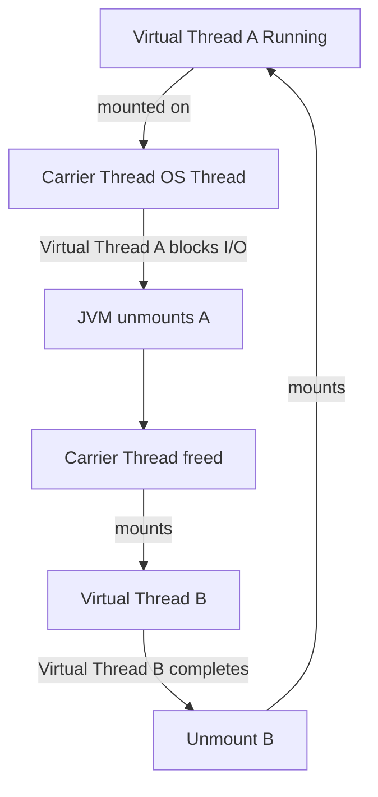
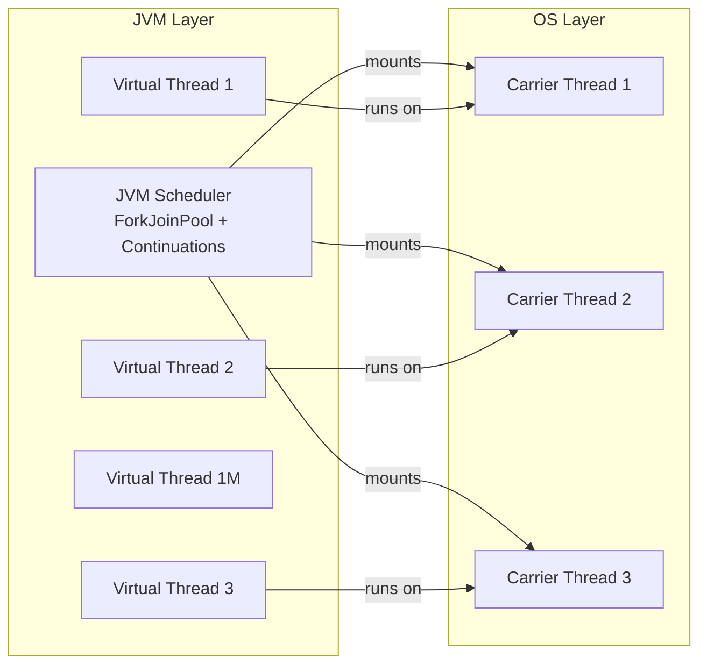
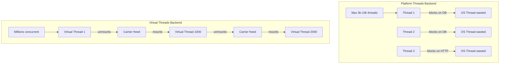
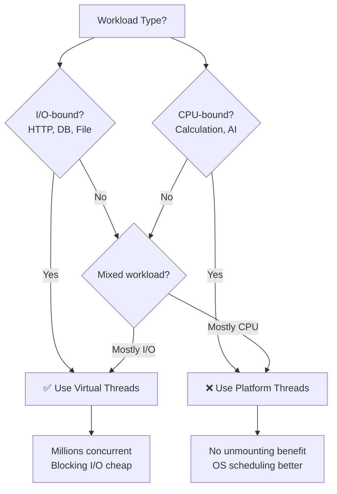

## Interview-Style Opening

Sure, let me first explain what virtual threads are and then walk through how they differ from platform threads and why they dramatically improve backend scalability in Java 21.

***

## Simple Explanation

**Virtual threads** are lightweight threads managed by the **JVM** instead of the operating system. Think of them as Java's modernized version of "green threads" — you can create millions of them without exhausting system resources.[^1][^2]

**Platform threads** (traditional Java threads) map 1:1 to OS threads — each Java thread consumes a real OS thread with heavy memory overhead.[^3]

***

## Why It Exists

### The Problem with Platform Threads

| Aspect | Cost with Platform Threads |
| :-- | :-- |
| Stack memory | ~1–2 MB per thread [^3] |
| Context switch | Kernel mode (slow) [^3] |
| Max threads | ~5k–10k before system slows [^3] |
| Blocking I/O | Wastes OS thread entirely [^1][^2] |

In traditional backends, when a thread blocks on I/O (JDBC call, HTTP request, file read), that **OS thread is wasted** — it consumes memory but does nothing.[^1]

### Why Virtual Threads Solve This

Virtual threads use **continuations** — the JVM can pause and resume execution without OS involvement. When a virtual thread blocks:[^3][^1]

- JVM **unmounts** it from the carrier thread
- Carrier thread freed to serve **other** virtual threads
- OS sees only a small pool of carrier threads (~CPU cores)[^3]

***

## Internal Working

### Mounting \& Unmounting (Key Mechanism)




### Architecture Overview



**Analogy**: OS threads = **trucks**, Virtual threads = **packages**. Few trucks deliver millions of packages efficiently.[^3]

***

## Practical Example

### Backend Scalability Scenario

```java
// ❌ Platform threads: Limited to ~5k-10k concurrent requests
for (int i = 0; i < 1_000_000; i++) {
    new Thread(() -> handleRequest()).start(); // Not scalable [web:2]
}

// ✅ Virtual threads: Millions concurrent, no problem
for (int i = 0; i < 1_000_000; i++) {
    Thread.startVirtualThread(() -> handleRequest()); // Scalable [web:2]
}
```


### Spring Boot 3 with Virtual Threads

```java
@Configuration
public class ThreadConfig {
    
    @Bean
    public ExecutorService virtualThreadExecutor() {
        return Executors.newVirtualThreadPerTaskExecutor();
    }
    
    @Bean
    public ServletWebServerFactory webServerFactory() {
        // Tomcat with virtual threads enabled
        return new TomcatServletWebServerFactory();
    }
}
```


***

## Code Example

```java
import java.util.concurrent.Executors;

public class VirtualThreadExample {
    
    public static void main(String[] args) {
        // Platform threads: traditional way
        ExecutorService platformExecutor = Executors.newFixedThreadPool(100);
        
        // Virtual threads: Java 21+
        ExecutorService virtualExecutor = Executors.newVirtualThreadPerTaskExecutor();
        
        // Simulate 10,000 concurrent HTTP requests with blocking I/O
        int requestCount = 10_000;
        
        // With platform threads: would need 10k OS threads (memory explosion)
        // With virtual threads: uses ~100 carrier threads (minimal memory)
        
        for (int i = 0; i < requestCount; i++) {
            virtualExecutor.submit(() -> {
                handleRequest(i);
            });
        }
        
        virtualExecutor.shutdown();
    }
    
    private static void handleRequest(int requestId) {
        // Blocking I/O: JDBC call, HTTP client, file read
        // With virtual threads: JVM unmounts during blocking
        // Carrier thread freed to serve other requests
        try {
            Thread.sleep(100); // Simulate I/O latency
            System.out.println("Request " + requestId + " completed");
        } catch (InterruptedException e) {
            Thread.currentThread().interrupt();
        }
    }
}
```


***

## Comparison: Virtual vs Platform Threads

| Feature | Platform Thread | Virtual Thread |
| :-- | :-- | :-- |
| **Managed by** | Operating System [^1][^4] | JVM [^1][^2] |
| **Stack memory** | 1–2 MB (fixed) [^3] | Few KB (heap, growable) [^3] |
| **Creation cost** | Heavy | ~1000× cheaper [^5] |
| **Scheduling** | OS kernel [^4] | JVM (ForkJoinPool) [^3] |
| **Max concurrent** | ~5k–10k [^3] | Millions [^2][^6] |
| **Blocking I/O** | Wastes OS thread [^1] | Unmounts, frees carrier [^1][^7] |
| **Thread priority** | Changeable [^4] | Fixed (cannot change) [^4] |
| **Daemon** | Optional | Always daemon [^4] |
| **Abstraction** | 1:1 with OS thread | JVM continuation [^3][^4] |


***

## How Virtual Threads Improve Backend Scalability

### 1. **Massive Throughput for I/O-Bound Workloads**



- **I/O-bound backends** (90% of web services): Virtual threads eliminate thread pool bottleneck[^6]
- No need for complex reactive programming (Project Reactor, RxJava) for scalability[^2]


### 2. **Lower Memory Footprint**

```
Memory for 10,000 concurrent requests:
- Platform threads: 10,000 × 2MB = 20 GB stack memory
- Virtual threads: 10,000 × 4KB = 40 MB heap memory
```


### 3. **Simpler Code Without Reactive Complexity**

```java
// ✅ Blocking code with virtual threads = scalable
@Async
public String fetchUserData(Long userId) {
    User user = userRepository.findById(userId); // Blocking JDBC
    return user.getName();
}

// ❌ Before: Needed reactive for same scalability
public Mono<String> fetchUserDataReactive(Long userId) {
    return userRepository.findByIdReactive(userId) // Non-blocking
        .map(User::getName);
}
```

Virtual threads let you write **simple blocking code** that's still highly scalable.[^2][^1]

### 4. **Performance Test Results**

Spring Boot 3 + JDK 21 high-load tests show:

- **Massive scalability** (1M+ concurrent requests)
- **Lower memory footprint** (~90% reduction)
- **Better throughput** under load[^8]

***

## When to Use Virtual Threads




### ✅ **Use Virtual Threads**

- HTTP servers (Tomcat, Jetty)[^8]
- Database calls (JDBC)[^1]
- External API calls[^6]
- File I/O operations[^2]


### ❌ **Use Platform Threads**

- CPU-bound computations (matrix operations, AI training)[^7]
- Tight loops with no blocking
- When you need thread priority control[^4]

***

## Senior Engineer Perspective

### What Junior Developers Miss

1. **Virtual threads aren't coroutines** — They're real `Thread` objects. You can use `Thread.currentThread()`, `synchronized`, locks, and `ThreadLocal`.[^7]
2. **Thread locals still work** — But `ScopedValue` (Java 21+) is preferred for virtual threads.[^7]
3. **No blocking avoidance needed** — Virtual threads are ~1000× cheaper, so "avoiding blocking" is useless. Write normal blocking code.[^5]
4. **Executor patterns change** — Use `Executors.newVirtualThreadPerTaskExecutor()` instead of fixed thread pools.[^8]

### Production Concerns

| Concern | Impact |
| :-- | :-- |
| **Thread dumps** | Millions of threads — use structured logging with thread IDs |
| **Debugging** | `ThreadLocal` behavior different — prefer `ScopedValue` |
| **Monitoring** | Carrier thread pool size matters (~CPU cores) [^3] |
| **Legacy code** | Works with existing blocking libraries (JDBC, HTTP clients) [^7] |
| **Migration cost** | Zero — just change executor configuration [^8] |


***

## Common Mistakes

| Mistake | Why Wrong | Fix |
| :-- | :-- | :-- |
| Trying to avoid blocking in virtual threads | 1000× cheaper — blocking is fine [^5] | Write normal blocking code |
| Using `newFixedThreadPool()` with virtual threads | Wrong executor pattern | Use `newVirtualThreadPerTaskExecutor()` [^8] |
| Expecting thread priority to work | Fixed priority, cannot change [^4] | Don't set priority |
| Using virtual threads for CPU-bound work | No unmounting benefit [^7] | Use platform threads |
| Assuming reactive is still needed | Virtual threads = scalable blocking [^2] | Simplify to blocking code |


***

## Follow-Up Questions (Real Interviewer Questions)

### 1. **"How do virtual threads handle `ThreadLocal`?"**

> Virtual threads support `ThreadLocal`, but each virtual thread has its own copy. For better safety, Java 21 introduced `ScopedValue` which is designed for virtual threads.[^7]

### 2. **"What happens when all carrier threads are busy?"**

> The JVM scheduler queues virtual threads. Carrier threads (~CPU cores) pick from the queue. Unlike platform threads, you don't hit OS limits.[^3]

### 3. **"Can you still use CompletableFuture with virtual threads?"**

> Yes. `CompletableFuture` works seamlessly. You can combine `newVirtualThreadPerTaskExecutor()` with CompletableFuture for async patterns.[^8]

### 4. **"How does this affect Tomcat/Spring Boot configuration?"**

> Spring Boot 3.2+ auto-enables virtual threads for Tomcat. Just set `server.threading.virtual-threads.enabled=true`.[^8]

### 5. **"What's the performance impact for CPU-heavy tasks?"**

> Virtual threads add JVM scheduling overhead. For CPU-bound work, platform threads are faster because OS scheduling is more efficient.[^7]

***

## Why Interviewers Ask This

| What's Evaluated | What They Want to Hear |
| :-- | :-- |
| **Modern Java knowledge** | Mentions Java 21, Project Loom, JEP 425 |
| **Scalability understanding** | I/O-bound vs CPU-bound distinction |
| **Production experience** | mentions ThreadLocal, executor patterns, monitoring |
| **Trade-off analysis** | When NOT to use virtual threads |
| **Reactive vs blocking** | Virtual threads eliminate reactive complexity need |

**Red flags**: Saying "avoid blocking" (wrong for virtual threads), confusing with coroutines, expecting thread priority to work.

***

## Interview Answer (30–60 Seconds)

> "Virtual threads in Java 21 are lightweight threads managed by the JVM instead of the OS. Unlike platform threads where 1 Java thread = 1 OS thread with 1–2 MB stack, virtual threads use heap-based continuations with only a few KB stack.
>
> The key difference is blocking: when a virtual thread blocks on I/O, the JVM unmounts it from its carrier thread, freeing that carrier to serve other virtual threads. This means you can have millions of concurrent virtual threads using only ~100 carrier threads.
>
> For backend scalability, this eliminates the thread pool bottleneck. You can write simple blocking code — JDBC calls, HTTP clients — and still handle 100k+ concurrent requests without reactive programming complexity. Memory drops from 20GB to 40MB for 10k requests, and throughput improves dramatically under load."

***

## Key Takeaways

1. **Virtual threads = JVM-managed**, platform threads = OS-managed[^1][^2]
2. **Blocking I/O is cheap** — JVM unmounts during blocking, frees carrier thread[^1][^7]
3. **Millions concurrent** vs ~5k–10k for platform threads[^6][^3]
4. **~1000× cheaper** — 4KB stack vs 2MB stack[^5][^3]
5. **Use for I/O-bound**, not CPU-bound workloads[^6][^7]

***

## Memory Notes (Add to Knowledge Base)

```
## Virtual Threads (Java 21, Project Loom)

### Core Difference
- Platform: 1 Java thread = 1 OS thread, 1-2MB stack, OS scheduling
- Virtual: JVM continuation, few KB heap stack, JVM scheduling

### Mounting/Unmounting
- Running: Virtual mounted on carrier thread
- Blocking: JVM unmounts, carrier freed for others
- Analogy: OS threads = trucks, Virtual = packages

### Scalability Impact
- 10k requests: 20GB (platform) → 40MB (virtual)
- Millions concurrent possible
- Eliminates thread pool bottleneck for I/O

### When to Use
✅ HTTP servers, JDBC, external APIs, file I/O
❌ CPU-bound calculations, tight loops

### Code Patterns
- newVirtualThreadPerTaskExecutor()
- Thread.startVirtualThread(() -> ...)
- ScopedValue preferred over ThreadLocal

### Production Notes
- ThreadLocal works but ScopedValue better
- Don't avoid blocking — it's cheap
- No thread priority control
- Always daemon threads
```


***

Do you want me to show a Spring Boot 3 performance comparison diagram between platform threads and virtual threads under high load?
<span style="display:none">[^10][^9]</span>

<div align="center">⁂</div>

[^1]: https://medium.com/@alxkm/virtual-threads-in-java-project-loom-a-new-era-of-concurrency-post-java-21-c371844d37a4

[^2]: https://medium.com/javarevisited/virtual-threads-in-java-21-the-end-of-concurrency-headaches-54f559bdf647

[^3]: https://www.linkedin.com/posts/akkili-indra-sena-reddy-56ab27169_platform-threads-vs-virtual-threads-activity-7409270581226864640-lyuK

[^4]: https://www.baeldung.com/openjdk-project-loom

[^5]: https://medium.com/@anil.java.story/project-loom-virtual-threads-part-1-b17e327c8ba7

[^6]: https://medium.com/@ucgorai/java-21-a-developers-perspective-on-virtual-threads-and-performance-gains-6b9d1f415d82

[^7]: https://dev.to/felipestanzani/project-loom-javas-virtual-threads-from-nightmares-to-modern-concurrency-bliss-3cm

[^8]: https://www.youtube.com/watch?v=UBJbsGNbSno

[^9]: https://www.youtube.com/watch?v=pZb9FMEuzvw

[^10]: https://blog.marcnuri.com/java-virtual-threads-project-loom-complete-guide

