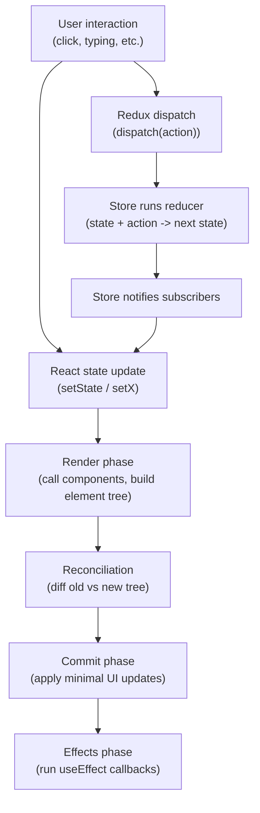

## 1. Interview-Style Opening

Sure—I'll cover how React works at runtime, how `useEffect` behaves, and how Redux works end-to-end, the way I’d explain it in an interview.

## 2. Problem Understanding and Clarification

You want interview-style explanations and typical questions around: (1) React rendering/reconciliation, (2) the `useEffect` hook and its dependency/cleanup semantics, and (3) Redux’s data flow (actions → reducer → store → UI).[^1][^2][^3]
Assumptions: you’re targeting modern React with function components and Hooks, and Redux usage in React (likely via React-Redux).[^2][^3]
Constraints: answer should be conceptual but concrete, and include pitfalls like effect dependencies and why Redux is “one-way data flow.”[^3][^4]
Edge cases to cover: effect cleanup and “don’t use an effect unless syncing with an external system,” plus React list keys/reconciliation and Redux state update propagation.[^1][^2][^3]

## 3. High-Level Approach (Before Code)

Brute-force mental model (common mistake): “React directly updates the DOM whenever state changes” and “`useEffect` is just ‘componentDidMount’.”[^5][^1]
Optimized mental model: React re-renders by calling your components to produce a new element tree, then reconciles (diffs) old vs new to determine minimal updates, then commits changes to the UI.[^1]
For `useEffect`: treat it as “run after render to synchronize with something outside React,” with a dependency array controlling re-runs and a cleanup function to undo subscriptions/timers when dependencies change or component unmounts.[^3][^5]
For Redux: one-way flow—UI dispatches an action, store runs reducers to compute next state, subscribers get notified and UI re-renders from the new state.[^4][^2]

Time complexity (engineering lens): React reconciliation is generally proportional to the size of the rendered subtree (and can degrade if keys/structure cause remounts), while Redux dispatch cost is tied to reducer work and subscriber updates.[^2][^1]
Space complexity: React holds component state and element trees; Redux holds a single global state tree in the store.[^2][^1]

## 4. Visual Explanation (Mermaid-First, Mandatory)



In interview terms: React updates are “render → reconcile → commit,” and `useEffect` runs after React has committed the update, while Redux sits as an external state container where dispatching actions produces a new state and triggers UI updates.[^5][^1][^2]

## 5. Java Code (Production-Quality)

```java
// Note: React/Redux are JavaScript/TypeScript libraries, so Java code isn't applicable here.
// If you want, I can provide interview-ready JS/TS snippets for:
// - useEffect patterns (fetching, subscriptions, cleanup)
// - Redux reducer + action flow
```


## 6. Code Walkthrough (Line-by-Line)

Since there’s no Java code to walk through for React/Redux, I’ll walk through the runtime flow instead: when state changes, React re-runs the component function to produce a new UI description, reconciles it with the previous one, commits minimal changes, and only then runs `useEffect`.[^5][^1]
For Redux, when you dispatch an action, the store invokes the reducer to compute the next state, then notifies subscribers so the UI can re-render based on the updated state.[^4][^2]

## 7. How I Would Explain This to the Interviewer

### How I Would Explain This to the Interviewer

So the key idea is React doesn’t “manually” mutate the DOM during your component function; it re-runs components to build a new element tree, reconciles differences, and commits only what changed.[^1]
`useEffect` is what I reach for when I need to synchronize the React component with something external—like a subscription, a timer, or an imperative API—and React will run that effect after render; the cleanup handles teardown on dependency change/unmount.[^3][^5]
Redux is a predictable state container: UI dispatches actions describing events, reducers compute the next state, and the store notifies subscribers so views update from state rather than pushing data around manually.[^4][^2]

## 8. Edge Cases and Follow-Up Questions

Key edge cases:

- `useEffect` dependencies: no array means run after every render; empty array means run on mount; cleanup runs on unmount and before re-running when dependencies change.[^3][^5]
- Don’t use `useEffect` if you’re not syncing with an external system; otherwise you can create unnecessary renders or loops.[^3]
- Reconciliation and keys: incorrect or unstable keys can cause remounts, lost state, and performance issues during diffing.[^1]

Follow-up questions (and brief answers):

- “When does `useEffect` run?” → After React commits DOM updates for that render, and cleanup runs on unmount or before re-running due to dependency changes.[^5][^3]
- “Why does Redux encourage one-way data flow?” → It makes state changes explicit via actions and keeps updates predictable through reducers and store notifications.[^2][^4]
- “What’s reconciliation?” → It’s React’s process of comparing previous vs next element trees to decide the minimal set of updates to apply.[^1]


## 9. Optimization and Trade-offs

React: optimizing often means stabilizing component identity and list keys so reconciliation can reuse work instead of tearing down and remounting subtrees.[^1]
`useEffect`: fewer effects and correct dependencies reduce accidental render loops and wasted work; if you’re just deriving UI from props/state, you likely don’t need an effect.[^3]
Redux: great for shared/global state and predictability, but it adds boilerplate and indirection; for mostly local UI state, React state (or context) can be simpler.[^4][^2]

## 10. Real-World Application and Engineering Methodology

In production, React + `useEffect` is commonly used to sync UI with external systems—API calls, WebSocket subscriptions, analytics events—where cleanup prevents leaks and duplicate subscriptions.[^5][^3]
Redux shows up when multiple parts of the UI need consistent shared state (auth/session, feature flags, cached server data metadata), and its action→reducer→store flow makes debugging and replaying changes easier.[^2][^4]
Engineering constraints: at scale you care about render frequency (latency), effect correctness (reliability), and state architecture (cost/complexity), so you standardize patterns (stable keys, disciplined effect usage, and predictable state updates).[^2][^3][^1]

If you want, I can convert this into a set of 15–20 “rapid-fire interview Q\&A” cards (with ideal answers) focusing specifically on “How React works,” `useEffect`, and “How Redux works.”
<span style="display:none">[^10][^11][^12][^13][^14][^15][^6][^7][^8][^9]</span>

<div align="center">⁂</div>

[^1]: https://legacy.reactjs.org/docs/reconciliation.html

[^2]: https://redux.js.org/tutorials/fundamentals/part-1-overview

[^3]: https://react.dev/reference/react/useEffect

[^4]: https://redux.js.org/tutorials/essentials/part-1-overview-concepts

[^5]: https://legacy.reactjs.org/docs/hooks-effect.html

[^6]: https://www.geeksforgeeks.org/reactjs/reactjs-reconciliation/

[^7]: https://www.developerway.com/posts/reconciliation-in-react

[^8]: https://cekrem.github.io/posts/react-reconciliation-deep-dive/

[^9]: https://shiftasia.com/community/reactjs-reconciliation-how-it-works/

[^10]: https://www.geeksforgeeks.org/reactjs/reactjs-useeffect-hook/

[^11]: https://stevekinney.com/courses/react-performance/understanding-reconciliation-react-19

[^12]: https://blog.logrocket.com/understanding-redux-tutorial-examples/

[^13]: https://www.greatfrontend.com/questions/quiz/what-is-reconciliation-in-react

[^14]: https://www.loginradius.com/blog/engineering/reacts-reconciliation-algorithm

[^15]: https://ko.react.dev/reference/react/useEffect

