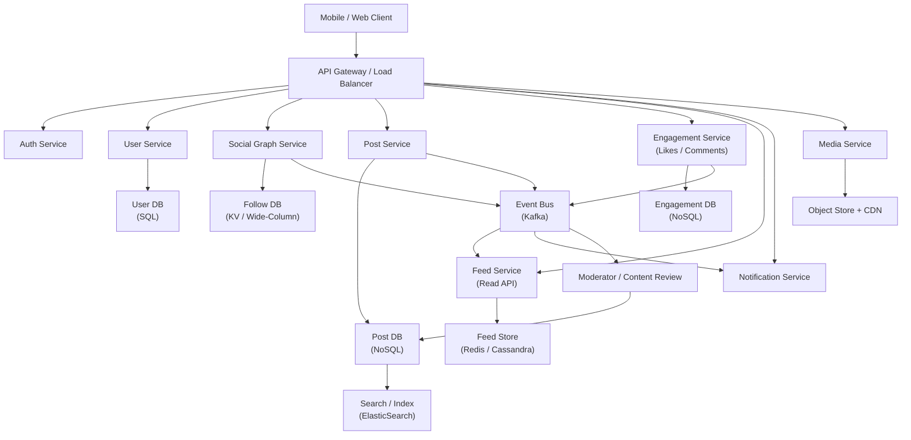

# design a facebook like social media : HLD

i will share the website link you need to prepare best notes for me with diagram and each and everything which is required for best HLD interview :

[https://www.interviewwithbunny.com/systemdesign/13](https://www.interviewwithbunny.com/systemdesign/13)

Sure, let me first structure the problem clearly and then walk you through a solid HLD that you can present confidently in interviews.

***

## 1. Interview-Style Opening

“Let me first outline the requirements for a Facebook-like social media platform, then I’ll propose a scalable high-level architecture, walk through the core components and data flows, and finally discuss trade-offs like feed generation models, storage choices, and scalability.”

***

## 2. Problem Understanding and Clarification

For “Facebook-like social media”, I’ll assume these **core features** (as also typically covered in such system-design discussions).[^1][^2]

- User onboarding: sign up, login, manage profile.
- Social graph: follow / friend (I’ll assume **follow** model like Instagram for simplicity).[^1]
- Posts: text + images (optionally video, but we can call that out as future extension).
- Engagements: likes, comments, maybe simple counters (like_count, comment_count).[^1]
- News feed: timeline of posts from people I follow, reasonably fresh, low-latency (sub-500 ms perceived load target).[^3][^1]
- Notifications: new follower, like, comment.[^2]
- Non-functional:
    - Scale: tens/hundreds of millions of users, millions of DAU.
    - High write volume on posts, likes, follows.
    - Low latency feed reads.
    - High availability, eventual consistency acceptable for counters/feed.

**Clarifications I’d confirm with the interviewer (in real interview):**

- “Can we assume only ‘follow’ relationships and skip bidirectional Facebook-style friends to keep it simpler?”
- “Is sub-500 ms feed load latency for P95 a reasonable target?”[^1]
- “Do we need to support videos in HLD, or can we treat all media as ‘large object in object store via CDN’?”

**Inputs \& Outputs (high level):**

- Inputs: API calls from mobile/web for signup/login, follow/unfollow, create post, like/comment, fetch feed, view profile.
- Outputs: JSON responses for these APIs, plus async pushes for notifications.

**Key edge cases to keep in mind:**

- Users with **huge follower counts** (celebrities) – feed fanout issues.[^3][^1]
- Deleted/blocked users or posts.
- Cold start feed (new user with no follows).
- Hot keys (very popular posts, hot users).

***

## 3. High-Level Approach (Before Code)

### 3.1 Brute-Force / Naive Approach

- Single monolith service + single relational DB (e.g., MySQL).
- Tables for Users, Follows, Posts, Likes, Comments.
- Feed query: `SELECT * FROM posts WHERE author IN (people_I_follow) ORDER BY created_at DESC LIMIT N`.
- Problems:
    - Query explodes for large follow lists, heavy joins.[^3]
    - Cannot scale to many users and high QPS.
    - Lacks horizontal scalability and resilience.


### 3.2 Optimized, Interview-Ready HLD

I’d design it as **microservice-ish** logical components behind an API Gateway:[^4][^3][^1]

- API Gateway / BFF.
- Auth Service.
- User Service + User DB.
- Social Graph Service (follow/unfollow) + Graph/Key-Value DB.[^5]
- Post Service + Post Store (NoSQL + Object Store for media).[^2][^1]
- Engagement (Like/Comment) Service + Engagement DB.[^1]
- Feed Service:
    - **Feed Fanout Workers / Materializer** consuming events (new post, follow) from Kafka (or any log).[^3][^1]
    - Precomputed per-user feeds in a fast store (Redis / Cassandra).[^4][^1]
- Notification Service (push/web notifications).[^2]
- Search / Index Service (ElasticSearch/OpenSearch) – optional for core HLD.[^2]
- Media Service + Object Store + CDN for images/videos.[^6][^2]


### 3.3 Feed Generation Model

Classic trade-off: **fanout on write vs fanout on read**.[^3][^1]

- **Fanout on write**: when a user posts, we push that post id into each follower’s feed timeline.
    - Pros: feed read is super fast (just fetch cached timeline).[^3]
    - Cons: heavy write amplification; problematic for celebrity accounts.
- **Fanout on read**: compute feed on demand by aggregating latest posts from followees.
    - Pros: cheap on writes; easier for celebrities.
    - Cons: slow reads, large aggregation queries.[^3]

Realistic approach (and what I’d present):

- **Hybrid model**:
    - For normal users, use **fanout on write**, store per-user feed in Redis/Cassandra.[^4][^3]
    - For extremely high-fanout users, do **partial fanout** or **on-read fetch** to avoid blowing up writes.[^3]


### 3.4 Datastores

- **User \& Auth**: Relational DB (e.g., MySQL/Postgres) for strong consistency \& constraints.[^2]
- **Social Graph**:
    - Key-value / Wide-column (e.g., Cassandra, DynamoDB) modeling follower/following lists.[^5]
- **Posts**:
    - Metadata (id, author, text, timestamps): NoSQL (Cassandra/DynamoDB) or sharded RDBMS.
    - Media content: Object Store (S3/GCS) fronted by CDN.[^6][^2]
- **Engagements (likes/comments)**:
    - NoSQL with write-optimized schema and counters; plus background materialization of counts.[^4][^1]
- **Feed**:
    - NoSQL (Cassandra) or Redis for per-user timeline lists.[^4][^3]
- **Search / indexing**:
    - ElasticSearch/OpenSearch cluster for text/search features.[^2]


### 3.5 Messaging and Asynchronous Processing

- Kafka (or similar) topics: `post_created`, `user_followed`, `like_created`, `comment_created`.[^1]
- Consumers:
    - Feed Materializer Service updates per-user feeds.[^4][^1]
    - Notification Service triggers notifications.
    - Analytics pipelines (not necessary to detail, but mention).


### 3.6 Complexity

At a high level:

- Feed read:
    - Time: $O(1)$ to fetch a pre-computed list segment from feed store (plus pagination).
    - Space: $O(F \cdot P)$ where $F$ is average follower count and $P$ is posts per user in feed horizon (mitigated via TTL or trimming).
- Write path:
    - Post creation: roughly $O(F)$ writes into follower timelines for fanout on write; mitigated via batching and hybrid strategy.[^3]

***

## 4. Visual Explanation (Mermaid-First, Mandatory)

### 4.1 High-Level Architecture Diagram



**How I’d explain this diagram in an interview:**

- Clients talk to the system through an API Gateway, which routes to multiple backend services.[^1][^4]
- Each core concern (users, social graph, posts, engagement, feed, media, notifications) is handled by a dedicated service and backing store.[^2][^4]
- Kafka decouples write-heavy operations like feed materialization and notifications from synchronous user flows.[^1]
- Media goes to object storage served via CDN to keep large files off the primary databases.[^6][^2]

***

## 5. Java Code (Production-Quality)

I’ll write **sample interfaces / key methods** for the **Feed Service** and **Post Service** to show how the fanout-on-write model might look. This is illustrative, not full production code.

```java
public class Post {
    private String id;
    private String authorId;
    private String text;
    private String mediaUrl;
    private long createdAtEpochMs;

    // getters, setters, constructors omitted for brevity
}

public interface PostRepository {
    void savePost(Post post);
    List<Post> getPostsByAuthor(String authorId, int limit, String paginationToken);
}

public interface SocialGraphRepository {
    // Followers of a user (who will receive this user's posts)
    List<String> getFollowerIds(String userId, int batchSize, String paginationToken);
}

public interface FeedRepository {
    void pushPostToUserFeed(String userId, String postId, long createdAtEpochMs);
    List<String> getFeedPostIds(String userId, int limit, String paginationToken);
}

public class PostService {

    private final PostRepository postRepository;
    private final EventPublisher eventPublisher; // wraps Kafka or other message bus

    public PostService(PostRepository postRepository,
                       EventPublisher eventPublisher) {
        this.postRepository = postRepository;
        this.eventPublisher = eventPublisher;
    }

    public Post createPost(String authorId, String text, String mediaUrl) {
        Post post = new Post();
        post.setId(IdGenerator.newId());
        post.setAuthorId(authorId);
        post.setText(text);
        post.setMediaUrl(mediaUrl);
        post.setCreatedAtEpochMs(System.currentTimeMillis());

        postRepository.savePost(post);

        // Publish asynchronous event for feed fanout, notifications, etc.
        eventPublisher.publishPostCreated(post);

        return post;
    }
}

public class FeedFanoutWorker {

    private final SocialGraphRepository socialGraphRepository;
    private final FeedRepository feedRepository;

    public FeedFanoutWorker(SocialGraphRepository socialGraphRepository,
                            FeedRepository feedRepository) {
        this.socialGraphRepository = socialGraphRepository;
        this.feedRepository = feedRepository;
    }

    // This would be triggered by consuming from the "post_created" topic
    public void handlePostCreated(Post post) {
        String authorId = post.getAuthorId();
        String paginationToken = null;

        while (true) {
            List<String> followerIds =
                    socialGraphRepository.getFollowerIds(authorId, 1000, paginationToken);
            if (followerIds.isEmpty()) {
                break;
            }

            for (String followerId : followerIds) {
                feedRepository.pushPostToUserFeed(
                        followerId,
                        post.getId(),
                        post.getCreatedAtEpochMs()
                );
            }

            // update pagination token for the next batch
            paginationToken = computeNextPaginationToken(followerIds);
        }
    }

    private String computeNextPaginationToken(List<String> lastBatch) {
        // implementation depends on underlying DB; placeholder here
        return lastBatch.get(lastBatch.size() - 1);
    }
}

public class FeedService {

    private final FeedRepository feedRepository;
    private final PostRepository postRepository;

    public FeedService(FeedRepository feedRepository,
                       PostRepository postRepository) {
        this.feedRepository = feedRepository;
        this.postRepository = postRepository;
    }

    public List<Post> getUserFeed(String userId, int limit, String paginationToken) {
        List<String> postIds =
                feedRepository.getFeedPostIds(userId, limit, paginationToken);

        // In practice, we might batch-load posts by IDs from PostDB
        List<Post> posts = new ArrayList<>(postIds.size());
        for (String postId : postIds) {
            // this would be replaced by a batch fetch in a real system
            posts.add(postRepository.getPostById(postId));
        }

        return posts;
    }
}
```


***

## 6. Code Walkthrough (Line-by-Line)

- `Post` class: represents the core post entity with id, author, text, optional media URL, and timestamp. This maps to rows in the Post DB and to JSON in APIs.
- `PostRepository`: abstraction over the Post DB (Cassandra/DynamoDB/SQL). We hide storage details behind this interface.
- `SocialGraphRepository`: provides follower lists for a user, likely backed by a wide-column DB or key-value store. We support pagination because some users may have millions of followers.[^5]
- `FeedRepository`: wraps access to the **Feed Store** where we maintain per-user timelines (lists of post IDs sorted by time).[^4][^3]

**PostService:**

- `createPost`:
    - Generates a new post id via some `IdGenerator` (e.g., Snowflake).
    - Persists the post in the Post DB via `postRepository.savePost`.
    - Publishes a `post_created` event asynchronously using `EventPublisher`. This decouples feed fanout and notification processing from the user’s request latency.[^1]

**FeedFanoutWorker:**

- This represents a background worker that consumes the `post_created` Kafka topic.[^1]
- For each post:
    - Fetches followers of the author in **batches** (e.g., 1000 at a time) to avoid loading the entire list into memory.
    - For each follower, calls `feedRepository.pushPostToUserFeed`, which appends the post id to that follower’s feed list in the Feed Store.[^4][^3]
    - Uses a pagination token pattern to walk through all followers.

This is the **fanout-on-write** logic; we can add guards here:

- If follower count exceeds a threshold (e.g., celebrity), we could either:
    - Push only to a subset (e.g., most engaged followers).
    - Or mark this author as “celebrity” and handle their posts differently (fanout on read).

**FeedService:**

- `getUserFeed`:
    - Reads a list of post IDs from the Feed Store for that user, with pagination.[^4][^3]
    - Fetches the corresponding Post objects (ideally in a batch).
    - Returns posts to the caller (API Gateway -> client).

The core idea: reads are cheap because the heavy work of computing the feed timelines happens asynchronously at write time.

***

## 7. How I Would Explain This to the Interviewer

“So the key idea here is to separate concerns: user management, social graph, posts, engagements, and feed generation all live in dedicated services with their own optimized data stores. On the write path, when a user creates a post, we persist it quickly and then emit an event to Kafka, so the synchronous API call remains fast. A background Feed Fanout worker consumes those events, looks up the author’s followers in a scalable key-value/wide-column store, and pushes the post ID into each follower’s feed list in a fast Feed Store like Redis or Cassandra.

On the read path, the client just asks for `/feed`, and the Feed Service reads a precomputed slice of post IDs from the Feed Store and joins them with post metadata. That gives us sub-500 ms feed loads even under high traffic, because we’ve moved the expensive joins and graph traversal off the critical path. For very high-fanout accounts, we can switch to a hybrid strategy where we don’t fully fan out on write, to avoid write amplification. Overall, this design scales horizontally, keeps latency under control, and is flexible enough to add features like notifications, search, and moderation via additional consumers of the same event streams.”[^5][^4][^3][^1]

***

## 8. Edge Cases and Follow-Up Questions

**Key Edge Cases:**

- **Celebrity fanout**: millions of followers – we need hybrid fanout or special handling, maybe separate topic partitioning and partial fanout.[^3]
- **Deleted posts/users**: soft deletes with background cleanup, plus filtering from feed queries.
- **Privacy / blocking**: store block lists and filter feed/graph results appropriately.
- **Cold start**: new user with no follows – show recommended content or “reels/explore” type feed powered by a recommendation system.
- **Feed freshness**: handle clock skew, deduplication, and out-of-order events; we may use server-generated timestamps.[^3]

**Likely Follow-Up Questions \& Brief Answers:**

1. **Q: How do you handle read/write hotspots for very popular posts?**
A: We avoid storing full engagement details on a single key; likes/comments are sharded or partitioned by post ID, and counters are updated via eventually consistent increments. We also cache hot posts aggressively.
2. **Q: How would you ensure the feed is still fresh if fanout workers lag behind?**
A: We can mix precomputed feed with a small “real-time tail” from recent posts fetched on read and merge-sort them by timestamp; plus scale workers horizontally using Kafka partitions.[^3]
3. **Q: How do you design the follow graph storage?**
A: Use a key-value/wide-column design: partition by userId, store sorted lists of followerIds and followingIds, with a secondary index / reverse lookup if needed; we can also use GSIs or a graph database if complexity grows.[^5]

***

## 9. Optimization and Trade-offs

- **Time vs Space**:
    - Fanout on write saves **read time** at the cost of increased **storage and write amplification**.[^3]
    - Precomputing per-user feeds means storing the same post ID many times; we mitigate via trimming (only last N items per feed) and possible compression.[^4]
- **Consistency vs Availability**:
    - We typically choose availability and accept eventual consistency; it’s okay if a like or comment counter is slightly stale.[^1]
    - Strong consistency may be limited to auth and critical user data.[^2]
- **Technology Choices**:
    - SQL vs NoSQL: user profile vs posts/feeds; relational for transactional, NoSQL for high-throughput append-heavy workloads.[^2][^4]
    - Kafka vs direct calls: Kafka decouples services and improves resilience, but adds operational complexity.[^1]
- **When this design may not be ideal**:
    - For small-scale applications (<100k users), this might be over-engineered; a simpler monolith with good indexing is enough.
    - If requirements demand strict ordering and strong consistency across multiple timelines, we might need stronger transactional guarantees and more complex ordering logic.

If scale or latency constraints change (e.g., global multi-region <100 ms), we’d lean more on **geo-replication, edge caching, CDNs, and possibly edge databases**, optimizing for read-locality.[^6]

***

## 10. Real-World Application and Engineering Methodology

In production, platforms like Facebook, Instagram, and Twitter follow very similar patterns: dedicated microservices for users/posts/graph, event-driven feed materialization, heavy caching, and hybrid feed generation models.[^7][^1][^3]

From an engineering methodology standpoint:

- We’d first **MVP** with a simpler architecture (maybe fewer services) and a pure fanout-on-read model.
- Once load grows and feed queries become slow, we’d:
    - Introduce Kafka to decouple producers and consumers.[^1]
    - Implement feed materialization and per-user timelines.
    - Add Redis/Cassandra for fast feed reads and caching.
- At global scale, we’d:
    - Add **CDN** for all media and static assets.[^6][^2]
    - Use region-based sharding of data to minimize cross-region reads.
    - Implement **circuit breakers**, **retries**, and **backpressure handling** around Kafka and downstream services to handle partial failures.

This design pattern shows up in many production systems: not just social media feeds, but also notification timelines, activity logs, and event streams.[^4][^3]

***

To tailor your notes further: would you prefer a **push-vs-pull focused deep dive on feed design** next, or a **DB schema + ERD-style focus** for interviews that emphasize data modeling?
<span style="display:none">[^10][^11][^12][^13][^14][^15][^16][^17][^18][^19][^20][^21][^22][^23][^24][^25][^26][^27][^28][^29][^30][^8][^9]</span>

<div align="center">⁂</div>

[^1]: https://www.youtube.com/watch?v=MQOz1yZaC54

[^2]: https://www.geeksforgeeks.org/system-design/design-facebook-system-design/

[^3]: https://algomaster.io/learn/system-design-interviews/design-fb-news-feed

[^4]: https://www.scribd.com/document/843536842/Design-a-Social-Media-Feed-like-Facebook-or-Twitter

[^5]: https://www.hellointerview.com/learn/system-design/problem-breakdowns/fb-news-feed

[^6]: https://www.youtube.com/watch?v=QkzarAFu7ZM

[^7]: https://getsdeready.com/system-design-for-social-media-platforms-like-instagram/

[^8]: https://mermaid.ai/docs/blog/posts/7-er-diagram-examples-for-database-modeling-from-mermaid-ai

[^9]: https://mermaid.ai/docs/blog/posts/how-to-build-an-er-diagram-with-mermaid-chart

[^10]: https://mermaid.ai/open-source/syntax/examples.html

[^11]: https://mermaid.ai/open-source/ecosystem/integrations-create.html

[^12]: https://www.mermaid.ai/web/

[^13]: https://mermaid.ai/open-source/syntax/architecture.html

[^14]: https://mermaid.ai/web/products/visual-editor/

[^15]: https://mermaid.ai/web/solutions/backend-and-data-engineers/

[^16]: https://mermaid.ai/open-source/config/usage.html

[^17]: https://mermaid.ai/docs/blog/posts/mermaid-chart-the-evolution-of-mermaid

[^18]: https://mermaid.ai/open-source/ecosystem/integrations-community.html

[^19]: https://mermaid.ai/open-source/syntax/gantt.html

[^20]: https://mermaid.ai/open-source/news/announcements.html

[^21]: https://mermaid.ai/web/solutions/software-and-infrastructure-engineers/

[^22]: https://mermaid.ai/open-source/config/directives.html

[^23]: https://www.designgurus.io/answers/detail/how-to-scale-a-social-media-platform-in-a-system-design-interview

[^24]: https://www.youtube.com/watch?v=S2y9_XYOZsg

[^25]: https://getsdeready.com/top-15-low-level-design-questions-asked-in-facebook-interviews/

[^26]: https://www.youtube.com/watch?v=fdz88OIOkp8

[^27]: https://www.designgurus.io/answers/detail/cracking-the-facebook-system-design-interview

[^28]: https://www.hellointerview.com/learn/system-design/problem-breakdowns/fb-post-search

[^29]: https://lifesage.substack.com/p/social-media-under-seige

[^30]: https://www.youtube.com/watch?v=yk6tkOhzVyA

